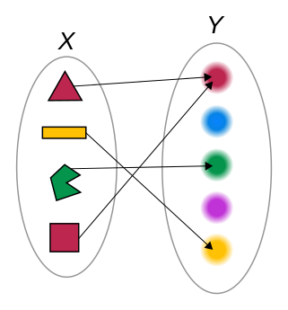
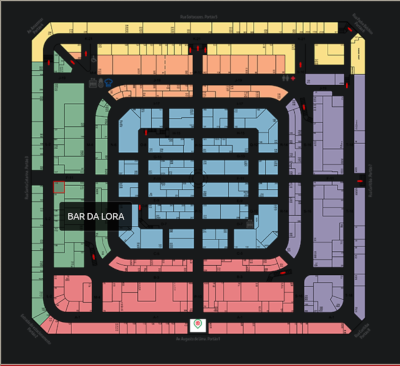
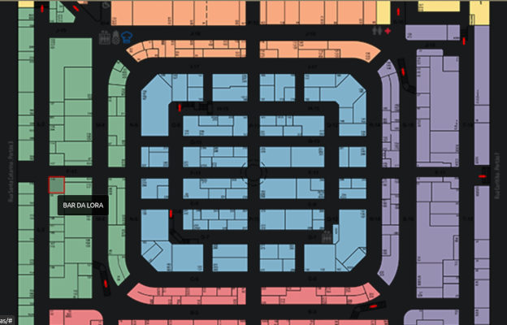
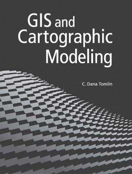
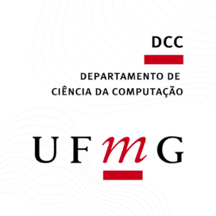
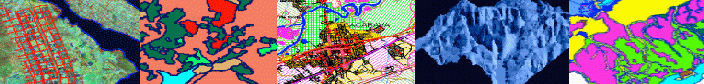
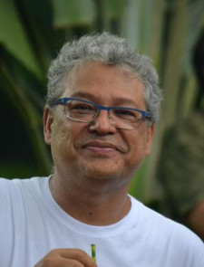

# O que é Álgebra de Mapas

## Álgebra

Em [Al-Khwarizmi e a descoberta da álgebra](https://impa.br/notices/folha-al-khwarizmi-e-a-descoberta-da-algebra/), Marcelo Viana conta um pouco sobre al-Khwarizmi, álgebra e algoritmo.

al-Khwarizmi, foi *matemático*, astrônomo, astrólogo, *geógrafo* e escritor dos séculos VIII e IX, esse é um sobrenome que faz referência a Khwarazm, o oásis às margens do mar de Aral onde ele teria nascido.

Ele revisou a obra **Geografia**, do astrônomo grego Claudio Ptolomeu dos séculos I e II. Também compilou o **Livro da Restauração e do Balanceamento**, no qual fez um estudo completo das equações de grau 1 (linear) ou 2 (quadrática).

> O que ele chama de "restauração" ("al-jabr" em árabe) é a transposição de termo de um lado da equação para o outro. Na tradução para o latim, realizada na Espanha no século XII, a palavra virou "algebra" e assim nasceu uma nova disciplina matemática.

Igualmente influente foi o trabalho sobre o sistema hindu de numeração, em latim, intitulada *"Algoritmi de Numero Indorum"* ("o que diz al-Khwarizm a respeito dos números indianos").

> Esse livro ensinou o Ocidente a fazer contas com a notação decimal, a tal ponto que a palavra "algoritmi" no título, que inicialmente se referia ao autor, acabou significando qualquer método de cálculo numérico ("algoritmo").

### Espaço Vetorial

Vamos trabalhar com espaço vetoriais, ou seja, com vetores e escalares. No caso os escalares serão números reais

<!-- $$\displaystyle \mathbb {R}$$
$$\displaystyle {\sqrt {2}}, \displaystyle \pi, \displaystyle e, \displaystyle \varphi$$ -->

## Mapa

<!--  -->

## Álgebra de Mapa

O tema da álgebra de mapa foi popularizado a partir da publicação do livro [*Geographic Information Systems and Cartographic Modeling (1990)*](https://archive.org/details/geographicinform00toml) do professor [Charles Dana Tomlin](https://www.design.upenn.edu/people/c-dana-tomlin), emérito da *Weitzman School of Design - University of Pennsylvania* nos Estados Unidos. Autor do livro *GIS and Cartographic Modeling (2012)*.

<!-- While primarily applied to raster data -->
<!-- a vocabulary and conceptual framework for classifying ways to combine map data to produce new maps -->

> A álgebra de mapas traz formas de combinar dados em forma de mapas para produzir novos mapas

### Geoinformação

Em [Introdução à Ciência da Geoinformação](http://www.dpi.inpe.br/gilberto/livro/introd/), editado e organizado por Gilberto Câmara, Clodoveu Davis e Antônio Miguel Vieira Monteiro, o capítulo 8 trata da álgebra de mapas detalhando as operações matemática, lógicas/booleanas, estatística, etc.

<!--
Operações sobre Campos: Álgebra de Mapas (pontuais, locais e zonais).
Relações espaciais: métricas, topológicas e direcionais.
Relações topológicas: 4-intersecções, 9-intersecções.
Interfaces e linguagens de consulta.
Operações sobre geo-objetos: consulta por atributos, consulta espacial, junção espacial. Operações mistas: conversão e mapeamento entre campos e objetos.
Linguagens de consulta e manipulação e visualização: "Spatial SQL", "LEGAL", "GRID". Exemplos de aplicações. Interfaces para linguagens (Bruns, AMO).
-->

$$ {\displaystyle \mathbb {R} } $$

